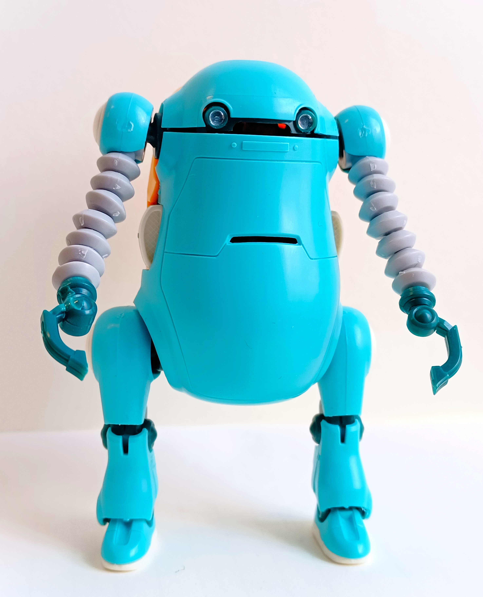
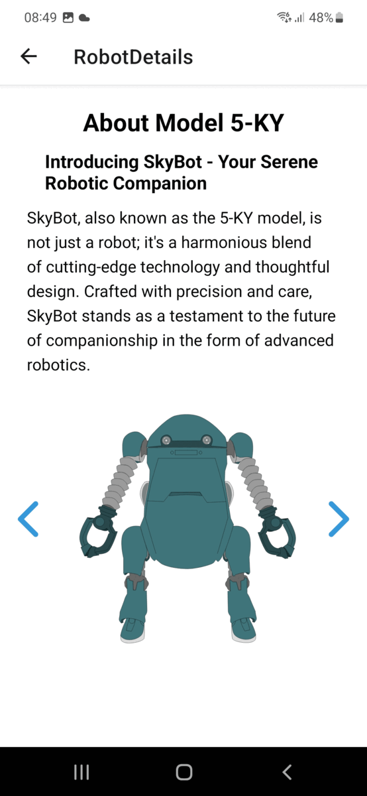

## About Project Nebula
I created this project as a means for me to develop my skills as a fresh developer, while also exploring and learning mobile app development, using React Native. 

So, I decided to go on a journey to create an app about something I really like - __Robots__!

Imagine a reality where having a companion bot is the norm and are an integral facet of everyday life. 

This app, made by (an imaginary) company called ChubbyBot, is designed to help you: 

* __Manage your robots__
* __Learn more about their personalities__
* __Explore their inner workings__ and learn more about the engineering that brings them to life
* __Stay up-to-date__ with the latest news about new robot models, new features and patch notes. 

Apart from these features, I've also implemented some admin support for adding, editing and deleting robot parts from the database. 

Currently, the focus lies on making the app work somewhat seamlessly and to get the key features down for the Android, and then maybe expand on that to other platforms. 

[Watch the demo video](https://drive.google.com/file/d/1w9IwC2jWfRegQ3M38KAJGz4N1-9lY9wP/view?usp=drive_link)
